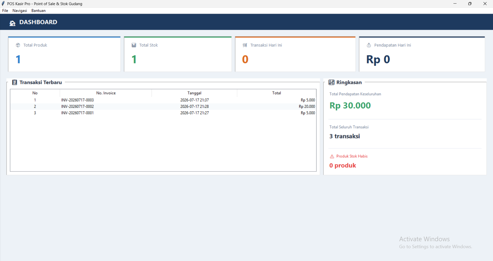
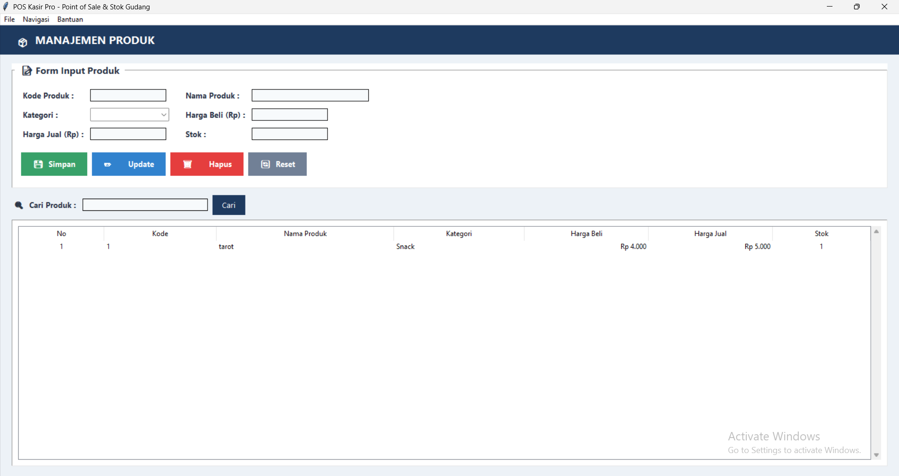
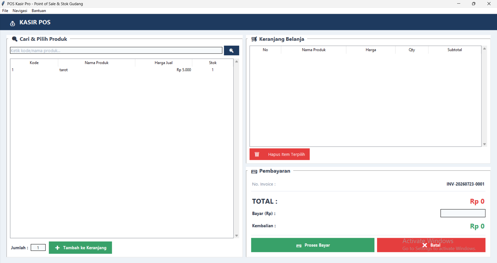
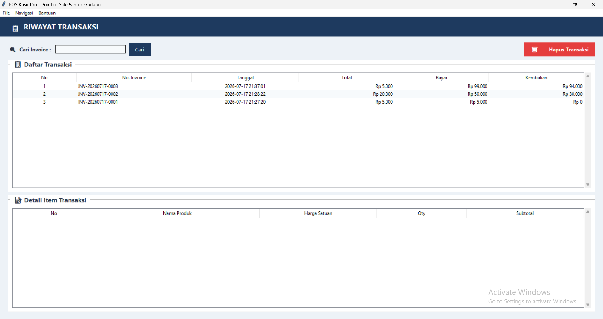

# 🛒 POS Kasir Pro - Aplikasi Point of Sale & Manajemen Stok

**Teknologi yang digunakan:** Python 3.8+ | GUI Tkinter | Database SQLite | Arsitektur MVC

**POS Kasir Pro** adalah aplikasi desktop modern berbasis Python untuk mengelola penjualan kasir (Point of Sale) sekaligus memantau persediaan stok gudang secara real-time. Aplikasi ini dirancang agar mudah dipahami, simpel, dan elegan untuk pengelolaan toko Anda.

---

## 🌟 Fitur Unggulan

- **📊 Dashboard Ringkas**
  Pantau total pendapatan, jumlah transaksi, dan cek stok habis dalam satu layar.
- **📦 Kelola Produk Mudah**
  Tambah, edit, dan hapus data barang secara instan (tersinkronisasi langsung ke database).
- **💸 Sistem Kasir Cepat**
  Hitung total belanjaan otomatis, hitung uang kembalian, dan proses transaksi tanpa ribet.
- **📜 Riwayat Transaksi**
  Lacak seluruh rekam jejak penjualan beserta rincian item dengan mudah.
- **⚡ Navigasi Super Cepat**
  Berpindah menu secara instan tanpa jeda memuat (*loading*) atau membuka jendela baru.

---

## 📸 Tampilan Aplikasi

Berikut adalah antarmuka dari aplikasi POS Kasir Pro:

| Dashboard Utama | Manajemen Produk |
| :---: | :---: |
|  |  |

| Layar Kasir | Riwayat Penjualan |
| :---: | :---: |
|  |  |

---

## ⚙️ Cara Menjalankan

Tidak perlu instalasi library tambahan. Aplikasi ini siap pakai!

1. Pastikan Anda sudah menginstal **Python (Minimal versi 3.8)**.
2. Buka Terminal atau Command Prompt.
3. Masuk ke dalam folder aplikasi:
   ```bash
   cd "D:\uas pbo" 
   ```
4. Mulai aplikasi dengan perintah:
   ```bash
   python main.py
   ```
*Catatan: File database `pos_kasir.db` akan dibuat secara otomatis saat aplikasi pertama kali dibuka.*

---

## 🏗️ Struktur Kode (Untuk Developer)

Aplikasi ini sangat cocok untuk dipelajari karena menerapkan rekayasa perangkat lunak yang rapi:
- **Arsitektur MVC**: Pemisahan yang ketat antara basis data (`model.py`), tampilan antarmuka (`view.py`), dan pengontrol utama (`main.py`).
- **Konsep OOP**: Menerapkan kelas *Singleton*, *Encapsulation* untuk keamanan database, serta *Inheritance* untuk membangun halaman antarmuka.

---
*Aplikasi Dibuat untuk memenuhi Tugas Proyek Akhir Mata Kuliah Pemrograman Berorientasi Objek.*
